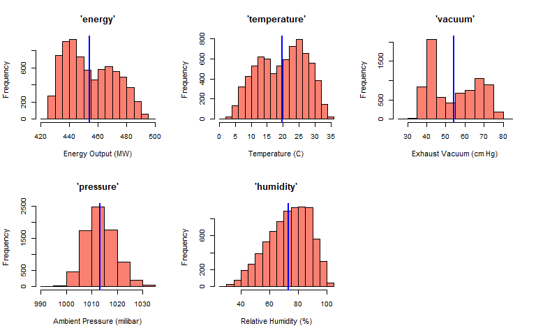
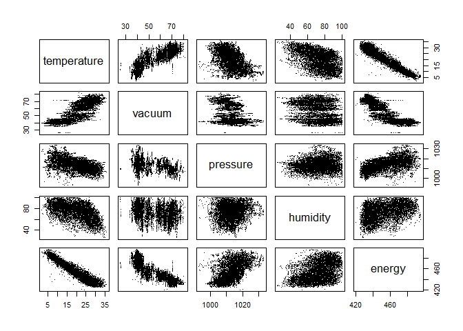
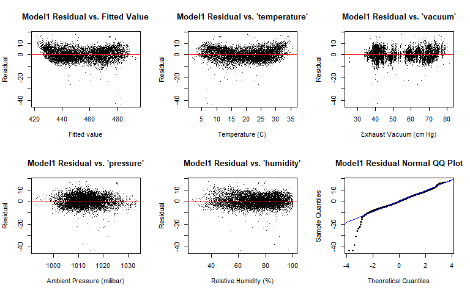
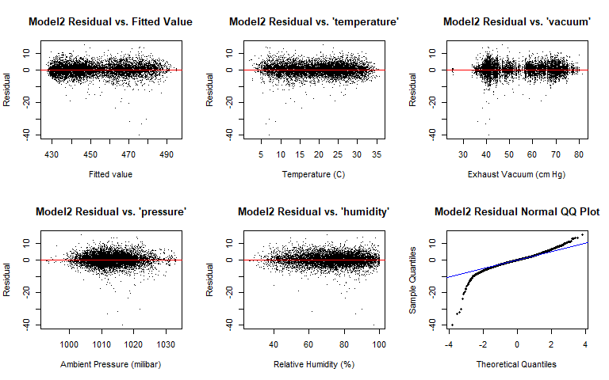
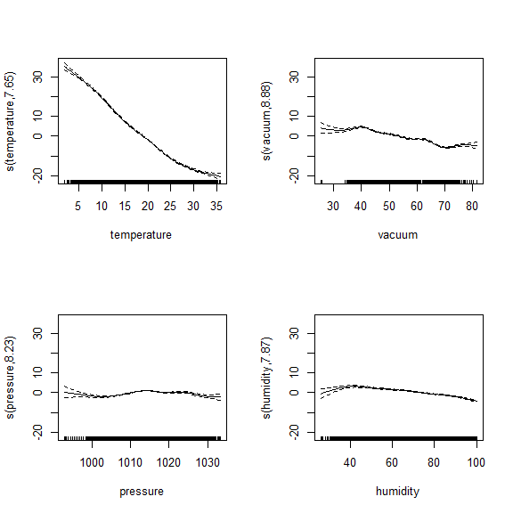
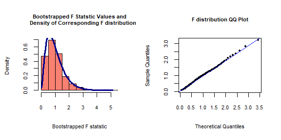
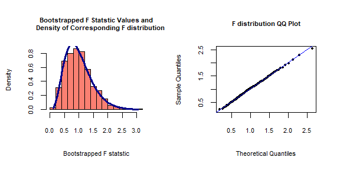
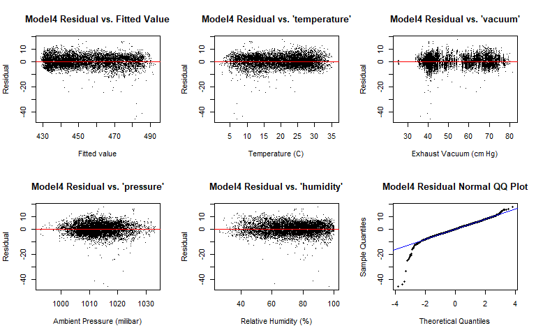

```r
library(readxl) # read excel
library(glmnet) # for lasso
library(FNN) # for k-nearest neighbors regression
library(knitr) # display table
library(np) # for kernel regression
library(mgcv) # for generalized additive models
```


# 1. Introduction & Data Splitting

The dataset comes from https://archive.ics.uci.edu/ml/datasets/Combined+Cycle+Power+Plant and contains measurements of features in a combined cycle power plant (CCPP) over 6 years (2006-2011).

(From the explanation in the dataset source website) A combined cycle power plant (CCPP) is composed of gas turbines (GT), steam turbines (ST) and heat recovery steam generators. In a CCPP, the electricity is generated by gas and steam turbines, which are combined in one cycle, and is transferred from one turbine to another. While the Vacuum is collected from and has effect on the Steam Turbine, the other three of the ambient variables affect the GT performance.

Let's load the dataset.


```r
ccpp.df = as.data.frame(read_excel("Folds5x2_pp.xlsx"))
```

As shown in the following code chunk, the dataset has 9568 observations, each with five variables.


```r
dim(ccpp.df)
```

```
## [1] 9568    5
```

Those five variables are:


```r
colnames(ccpp.df)
```

```
## [1] "AT" "V"  "AP" "RH" "PE"
```

where the variables are recorded as hourly average values:

* **AT**: Temperature in the range 1.81°C and 37.11°C
* **V**: Exhaust Vacuum in teh range 25.36-81.56 cm Hg
* **AP**: Ambient Pressure in the range 992.89-1033.30 milibar
* **RH**: Relative Humidity in the range 25.56% to 100.16%
* **PE**: Net hourly electrical energy output 420.26-495.76 MW

Let's rename the columns of our dataframe just for more clarity.


```r
# "AT" renamed as "temperature"
# "V" renamed as "vacuum"
# "AP" renamed as "pressure"
# "RH" renamed as "humidity"
# "PE" renamed as "energy"
colnames(ccpp.df) = c("temperature", "vacuum", "pressure", "humidity", "energy")
```

Our task is to predict the energy output (i.e. **energy**) from the four predictors (i.e. **temperature**, **vacuum**, **pressure**, and **humidity**). More specifically, this task is a regression problem, and we will be working with several regression models (parametric, non-parametric, and additive models) and do model selection and verification of significance tests via statistical methods like cross-validation, forward stepwise regression, the lasso, and bootstrapping.

Let's randomly split this dataset of 9568 observations into training data (7500 datapoints) and test data (2068 datapoints). As usual, we'll only use the training set for all the analysis and modeling, and then use the test set only for the final prediction.


```r
set.seed(42)

test.indices = sample(1:9568, size=2068, replace=FALSE)
train.ccpp.df = ccpp.df[-test.indices,]
test.ccpp.df = ccpp.df[test.indices,]

# Reset row indices of training set and test set
rownames(train.ccpp.df) = NULL
rownames(test.ccpp.df) = NULL
```

The first five rows of our finalized training dataset looks like:


```r
train.ccpp.df[1:5,]
```

```
##   temperature vacuum pressure humidity energy
## 1       14.96  41.76  1024.07    73.17 463.26
## 2       25.18  62.96  1020.04    59.08 444.37
## 3       10.82  37.50  1009.23    96.62 473.90
## 4       26.27  59.44  1012.23    58.77 443.67
## 5       15.89  43.96  1014.02    75.24 467.35
```


# 2. Exploratory Data Analysis

First, let's do some exploratory data analysis on the variables: the response variable **energy** and the predictors **temperature**, **vacuum**, **pressure**, and **humidity**.

Here we show the shape of each variable's marginal distribution: we draw a histogram and add a blue vertical line that indicates the mean value. 


```r
par(mfrow=c(2,3))

# 1. The response variable 'energy'
hist(train.ccpp.df$energy,
     xlab="Energy Output (MW)", ylab="Frequency", main="'energy'",
     freq=TRUE, cex.axis=0.9, col="salmon")
abline(v=mean(train.ccpp.df$energy), lwd=2, col="blue")

# 2. The predictor 'temperature'
hist(train.ccpp.df$temperature,
     xlab="Temperature (C)", ylab="Frequency", main="'temperature'",
     freq=TRUE, cex.axis=0.9, col="salmon")
abline(v=mean(train.ccpp.df$temperature), lwd=2, col="blue")

# 3. The predictor 'vacuum'
hist(train.ccpp.df$vacuum,
     xlab="Exhaust Vacuum (cm Hg)", ylab="Frequency", main="'vacuum'",
     freq=TRUE, cex.axis=0.9, col="salmon")
abline(v=mean(train.ccpp.df$vacuum), lwd=2, col="blue")

# 4. The predictor 'pressure'
hist(train.ccpp.df$pressure,
     xlab="Ambient Pressure (milibar)", ylab="Frequency", main="'pressure'",
     freq=TRUE, cex.axis=0.9, col="salmon")
abline(v=mean(train.ccpp.df$pressure), lwd=2, col="blue")

# 5. The predictor 'humidity'
hist(train.ccpp.df$humidity,
     xlab="Relative Humidity (%)", ylab="Frequency", main="'humidity'",
     freq=TRUE, cex.axis=0.9, col="salmon")
abline(v=mean(train.ccpp.df$humidity), lwd=2, col="blue")
```

<!-- -->

The marginal distribution of **humidity** has a slightly left-skewed shape, while that of **pressure** has a reasonably symmetric shape. The other three variables have a bimodal distribution, where **temperature** has the larger mode (values around 25 C) being more frequent than the smaller mode (values around 12 C), while for **energy** and **vacuum** the smaller mode is more frequent than the larger mode.

Next, let's examine how the association for each pair among the five variables (**energy**, **temperature**, **vacuum**, **pressure**, and **humidity**) looks like. Here we draw a pairs plot among those five variables.


```r
pairs(train.ccpp.df, pch=".")
```

<!-- -->

Let's focus on the association between the response variable **energy** and each of the predictors. According to the pairs plot, **temperature** and **vacuum** appear to have a negative association with **energy**. It seems that **pressure** has a positive, but not so strong, relationship with **energy**, and the association between **humidity** and **energy** appears to be not strong at all. Perhaps the four associations are not all reasonably linear ones. But of course, we can't formally conclude anything here: we'll discuss details when we actually fit statistical models later on. 


# 3. Initial Modeling - Linear Regression

As our initial model, let's fit a multiple linear regression model where all the four predictors are included. First, let's check if there is the multicollinearity problem by checking the eigenvalues of the gram matrix.


```r
# Design matrix
X = cbind(1, as.matrix(train.ccpp.df[,-5]))

# Gram matrix
XTX = t(X) %*% X

# Eigenvalues of the gram matrix
eigen(XTX, symmetric=TRUE)$values
```

```
## [1] 7.766485e+09 2.147705e+06 1.025654e+06 6.947148e+04 1.663925e-01
```

Since the gram matrix does not have an eigenvalue of 0, there is no multicollinearity problem, so let's fit the model, which we call Model1. Here is the summary of the Model1 fit.


```r
Model1 = lm(energy ~ ., data=train.ccpp.df)

summary(Model1)
```

```
## 
## Call:
## lm(formula = energy ~ ., data = train.ccpp.df)
## 
## Residuals:
##     Min      1Q  Median      3Q     Max 
## -43.331  -3.150  -0.135   3.155  17.754 
## 
## Coefficients:
##               Estimate Std. Error  t value Pr(>|t|)    
## (Intercept) 449.290990  11.195089   40.133  < 2e-16 ***
## temperature  -1.965809   0.017277 -113.782  < 2e-16 ***
## vacuum       -0.238407   0.008187  -29.122  < 2e-16 ***
## pressure      0.067120   0.010862    6.179 6.77e-10 ***
## humidity     -0.155467   0.004700  -33.081  < 2e-16 ***
## ---
## Signif. codes:  0 '***' 0.001 '**' 0.01 '*' 0.05 '.' 0.1 ' ' 1
## 
## Residual standard error: 4.567 on 7495 degrees of freedom
## Multiple R-squared:  0.9283,	Adjusted R-squared:  0.9283 
## F-statistic: 2.426e+04 on 4 and 7495 DF,  p-value: < 2.2e-16
```

The model equation is:

$$
\text{energy}_{i} = \beta_{0} + \beta_{1} \cdot \text{temperature}_{i} + \beta_{2} \cdot \text{vacuum}_{i} + \beta_{3} \cdot \text{pressure}_{i} + \beta_{4} \cdot \text{humidity}_{i} + \epsilon_{i}
$$

where $\epsilon_{1}, \cdots , \epsilon_{n} \sim N(0, \sigma^{2})$ are independent and identically distributed (i.i.d) with $n$ denoting the number of training examples.

According to the model fit output, the fitted model equation is:

$$
\begin{split}
\widehat{\text{energy}} &= \hat{\beta}_{0} + \hat{\beta}_{1} \cdot \text{temperature} + \hat{\beta}_{2} \cdot \text{vacuum} + \hat{\beta}_{3} \cdot \text{pressure} + \hat{\beta}_{4} \cdot \text{humidity} \\
&= 449.290990 - 1.965809 \cdot \text{temperature} - 0.238407 \cdot \text{vacuum} + 0.067120 \cdot \text{pressure} - 0.155467 \cdot \text{humidity}
\end{split}
$$

## 3.1 Residual Plots

Let's draw the residual plots for Model1 and also the model's residuals Normal QQ plot.


```r
par(mfrow=c(2,3))

# Model1: Residuals vs. Fitted values
plot(x=Model1$fitted.values, y=Model1$residuals,
     xlab="Fitted value", ylab="Residual",
     main="Model1 Residual vs. Fitted Value", pch=".")
abline(h=0, col="red")

# Model1: Residuals vs. predictor 'temperature'
plot(x=train.ccpp.df$temperature, y=Model1$residuals,
     xlab="Temperature (C)", ylab="Residual",
     main="Model1 Residual vs. 'temperature'", pch=".")
abline(h=0, col="red")

# Model1: Residuals vs. predictor 'vacuum'
plot(x=train.ccpp.df$vacuum, y=Model1$residuals,
     xlab="Exhaust Vacuum (cm Hg)", ylab="Residual",
     main="Model1 Residual vs. 'vacuum'", pch=".")
abline(h=0, col="red")

# Model1: Residuals vs. predictor 'pressure'
plot(x=train.ccpp.df$pressure, y=Model1$residuals,
     xlab="Ambient Pressure (milibar)", ylab="Residual",
     main="Model1 Residual vs. 'pressure'", pch=".")
abline(h=0, col="red")

# Model1: Residuals vs. predictor 'humidity'
plot(x=train.ccpp.df$humidity, y=Model1$residuals,
     xlab="Relative Humidity (%)", ylab="Residual",
     main="Model1 Residual vs. 'humidity'", pch=".")
abline(h=0, col="red")

# Model1: Normal QQ plot of residuals
qqnorm(Model1$residuals, pch=16, cex=0.7,
       main="Model1 Residual Normal QQ Plot")
qqline(Model1$residuals, col="blue")
```

<!-- -->

The residual vs **pressure** plot and the residual vs **humidity** plot don't indicate big violations on the model assumptions. But in the residual vs fitted value and the residual vs **temperature** plots, we see a curvature: more specifically, a pattern in which the residuals at the far left and far right of the x-axis tend to be larger than those in the center of the x-axis. This result suggests that the model assumption of linearity is not reasonably satisfied. Moreover, the residual vs **vacuum** plot has the variability of the residuals not reasonably consistent, so the linear model's assumption of constant variance of the noise terms does not hold well here. Lastly, the Normal QQ plot has lots of systematic deviations from the Normal line, suggesting that the assumption that the noise terms are Normally distributed is not satisfied as well.

So although the model fit output says that every predictor is statistically significant in the sense that the corresponding parameter is significantly different from 0 according to the t-tests, the model assumptions are not reasonably satisfied overall. Now let's try other models for this dataset.

## 3.2 Variable Selection via the Lasso

Before moving on to non-parametric models, let's use the lasso which does variable selection via L1-regularization. We can see that for all the four predictors, the corresponding entry in the lasso's estimator is non-zero, so it chose to include all the four. That is, the chosen model is actually Model1 itself. So let's choose Model1 among the linear models.


```r
lasso.cvfit = cv.glmnet(X ,train.ccpp.df$energy)
coef(lasso.cvfit, s="lambda.min")
```

```
## 6 x 1 sparse Matrix of class "dgCMatrix"
##                        1
## (Intercept) 449.00534035
##               .         
## temperature  -1.94454924
## vacuum       -0.24151275
## pressure      0.06651912
## humidity     -0.14665189
```


# 4. k-Nearest Neighbors (kNN) Regression

For our first non-parametric model, let's use k-nearest neighbors (kNN) regression, where for a given evaluation point, we predict by taking the average of the response variable values of the $k$ nearest neighbors.

## 4.1 Choosing k via Cross-Validation

A key aspect in kNN regression is choosing the value of $k$. The smaller the value of $k$, the more likely we'll face overfitting, and the larger the value of $k$, we'll more likely encounter oversmoothing. This issue of overfitting and oversmoothing is also related to the issue of bias-variance tradeoff, and thus it's important to find a good balance: in this case, a good value of $k$.

Let's use 5-fold cross-validation for choosing the value of $k$. Since the training set has 7500 datapoints, we assign 1500 datapoints to each of the 5 folds.


```r
set.seed(42)
validation.indices = sample(c(rep(1:5, 1500)), replace=FALSE)

k.candidates = c(2, 5, 10, 25, 50, 100)
record.mat = matrix(rep(0,30), nrow=5)
rownames(record.mat) = c("Fold 1", "Fold 2", "Fold 3", "Fold 4", "Fold 5")
colnames(record.mat) = c("k=2", "k=5", "k=10", "k=25", "k=50", "k=100")

for (k in k.candidates) {
  col = which(k.candidates==k)
  for(cv.fold in 1:5) {
    valid.df = train.ccpp.df[validation.indices==cv.fold,]
    train.df = train.ccpp.df[validation.indices!=cv.fold,]
    # Fit kNN regression on train set
    knn = knn.reg(train=train.df[,1:4], test=valid.df[,1:4], y=train.df[,5], k=k)
    # Compute MSE on validation set
    cv.fold.mse = mean((valid.df[,5] - knn$pred)^2)
    # Record it!
    record.mat[cv.fold, col] = cv.fold.mse
  }
}

kable(record.mat, caption="Average Squared Prediction Error for Each (Fold, k)",
      format="markdown")
```


|       |      k=2|      k=5|     k=10|     k=25|     k=50|    k=100|
|:------|--------:|--------:|--------:|--------:|--------:|--------:|
|Fold 1 | 18.56384| 16.94773| 16.79192| 18.23047| 19.84127| 22.18634|
|Fold 2 | 19.91762| 17.89874| 18.16093| 20.00123| 21.97010| 24.47799|
|Fold 3 | 18.83781| 16.89670| 17.41978| 18.85974| 20.75003| 23.07470|
|Fold 4 | 17.13236| 15.96360| 17.24352| 18.93127| 20.58276| 22.65144|
|Fold 5 | 17.99193| 16.27679| 16.53618| 18.17150| 19.88924| 22.66669|

For small $K$ (i.e. number of folds) like our $K=5$, an estimate of the standard error of the cross-validation mean-sqaured error (MSE) values for a model can be computed by dividing the sample standard deviation of the MSE values by $\sqrt{K}$.

The table below shows the average and estimated standard error of the cross-validation scores for each model.


```r
# 1. k=2
k2.avg.CV.error = mean(record.mat[,1])
k2.se.CV.error = (1/sqrt(5)) * sd(record.mat[,1])

# 2. k=5
k5.avg.CV.error = mean(record.mat[,2])
k5.se.CV.error = (1/sqrt(5)) * sd(record.mat[,2])

# 3. k=10
k10.avg.CV.error = mean(record.mat[,3])
k10.se.CV.error = (1/sqrt(5)) * sd(record.mat[,3])

# 4. k=25
k25.avg.CV.error = mean(record.mat[,4])
k25.se.CV.error = (1/sqrt(5)) * sd(record.mat[,4])

# 5. k=50
k50.avg.CV.error = mean(record.mat[,5])
k50.se.CV.error = (1/sqrt(5)) * sd(record.mat[,5])

# 6. k=100
k100.avg.CV.error = mean(record.mat[,6])
k100.se.CV.error = (1/sqrt(5)) * sd(record.mat[,6])

CV.score.summary.mat = matrix(c(k2.avg.CV.error, k5.avg.CV.error,
                                k10.avg.CV.error, k25.avg.CV.error,
                                k50.avg.CV.error, k100.avg.CV.error,
                                k2.se.CV.error, k5.se.CV.error,
                                k10.se.CV.error, k25.se.CV.error,
                                k50.se.CV.error, k100.se.CV.error),
                              nrow=6, byrow=FALSE)
rownames(CV.score.summary.mat) = c("k=2", "k=5", "k=10", "k=25", "k=50", "k=100")
colnames(CV.score.summary.mat) = c("Average MSE across Folds", "Estimated Standard Error")
kable(CV.score.summary.mat, 
      caption="Average and Estimated Standard Error of Cross-Validation MSE Estimate 
      for Each k", format="markdown")
```


|      | Average MSE across Folds| Estimated Standard Error|
|:-----|------------------------:|------------------------:|
|k=2   |                 18.48871|                0.4612917|
|k=5   |                 16.79671|                0.3325408|
|k=10  |                 17.23047|                0.2807249|
|k=25  |                 18.83884|                0.3298172|
|k=50  |                 20.60668|                0.3860444|
|k=100 |                 23.01143|                0.3926841|

We can see that $k=5$ has the lowest cross-validation MSE score. Notice that for every value of $k$ other than $k=5$ (i.e. $k=2$, $k=10$, $k=25$, $k=50$, $k=100$), the absolute difference between the corresponding MSE and the MSE of $k=5$ is greater than the two corresponding estimated standard errors. So the differences are all not negligible; That is: the differences are indeed meaningful, and we can say that $k=5$ is the best choice among those values. So for our kNN regression model, let's choose kNN with $k=5$, which we call Model2.


```r
Model2 = knn.reg(train=train.ccpp.df[,1:4], test=train.ccpp.df[,1:4], 
                 y=train.ccpp.df[,5], k=5)

Model2.residuals = train.ccpp.df[,5] - Model2$pred
```

## 4.2 Residual Plots

Let's draw the residual plots for Model2.


```r
par(mfrow=c(2,3))

# Model2: Residuals vs. Fitted values
plot(x=Model2$pred, y=Model2.residuals,
     xlab="Fitted value", ylab="Residual",
     main="Model2 Residual vs. Fitted Value", pch=".")
abline(h=0, col="red")

# Model2: Residuals vs. predictor 'temperature'
plot(x=train.ccpp.df$temperature, y=Model2.residuals,
     xlab="Temperature (C)", ylab="Residual",
     main="Model2 Residual vs. 'temperature'", pch=".")
abline(h=0, col="red")

# Model2: Residuals vs. predictor 'vacuum'
plot(x=train.ccpp.df$vacuum, y=Model2.residuals,
     xlab="Exhaust Vacuum (cm Hg)", ylab="Residual",
     main="Model2 Residual vs. 'vacuum'", pch=".")
abline(h=0, col="red")

# Model2: Residuals vs. predictor 'pressure'
plot(x=train.ccpp.df$pressure, y=Model2.residuals,
     xlab="Ambient Pressure (milibar)", ylab="Residual",
     main="Model2 Residual vs. 'pressure'", pch=".")
abline(h=0, col="red")

# Model2: Residuals vs. predictor 'humidity'
plot(x=train.ccpp.df$humidity, y=Model2.residuals,
     xlab="Relative Humidity (%)", ylab="Residual",
     main="Model2 Residual vs. 'humidity'", pch=".")
abline(h=0, col="red")

# Model2: Normal QQ plot of residuals
qqnorm(Model2.residuals, pch=16, cex=0.7,
       main="Model2 Residual Normal QQ Plot")
qqline(Model2.residuals, col="blue")
```

<!-- -->

Not all the five residual plots have the variability (vertical spread) of the residuals being reasonably consistent across the x-axis: especially in the residual vs **vacuum** plot. So the model assumption that the noise terms $\epsilon_{i}$'s have a constant variance is not reasonably satisfied. Moreover, the Normal QQ plot has lots of systematic deviations from the Normal line, suggesting that the assumption that the noise terms are Normally distributed is not satisfied as well.


# 5. Kernel Regression

Next, let's use kernel regression (a.k.a Nadaraya-Watson regression), which is another non-parametric model. An important part of kernel regression is choosing the bandwidth value for each predictor. Here, we use a common heuristic, which is to: for each predictor, divide the standard deviation by $n^{1/5}$ where $n$ is the number of training examples.

## 5.1 Variable Selection via Forward Stepwise Regression

For our kernel regression model, let's try to do variable selection. We can do so by performing a forward stepwise regression, and for its criterion let's use validation MSE via data splitting: split the training data ('train.ccpp.df') into a train set ('train.df') and a validation set ('valid.df'), where we fit on the former and predict on the latter.


```r
n = nrow(train.ccpp.df)
set.seed(42)
validation.indices = sample(1:n, size=1500, replace=FALSE)
valid.df = train.ccpp.df[validation.indices,]
train.df = train.ccpp.df[-validation.indices,]

# First predictor to add
# 1. temperature
bws = sd(train.df$temperature) / (nrow(train.df)^0.2)
kernel.reg = npreg(energy ~ temperature, data=train.df, residuals=TRUE, bws=bws)
predictions = predict(kernel.reg, newdata=valid.df)
temperature.mse = mean((valid.df$energy - predictions)^2)
# 2. vacuum
bws = sd(train.df$vacuum) / (nrow(train.df)^0.2)
kernel.reg = npreg(energy ~ vacuum, data=train.df, residuals=TRUE, bws=bws)
predictions = predict(kernel.reg, newdata=valid.df)
vacuum.mse = mean((valid.df$energy - predictions)^2)
# 3. pressure
bws = sd(train.df$pressure) / (nrow(train.df)^0.2)
kernel.reg = npreg(energy ~ pressure, data=train.df, residuals=TRUE, bws=bws)
predictions = predict(kernel.reg, newdata=valid.df)
pressure.mse = mean((valid.df$energy - predictions)^2)
# 4. humidity
bws = sd(train.df$humidity) / (nrow(train.df)^0.2)
kernel.reg = npreg(energy ~ humidity, data=train.df, residuals=TRUE, bws=bws)
predictions = predict(kernel.reg, newdata=valid.df)
humidity.mse = mean((valid.df$energy - predictions)^2)

record.mat = matrix(c(temperature.mse, vacuum.mse, pressure.mse, humidity.mse), 
                    nrow=4)
rownames(record.mat) = c("temperature", "vacuum", "pressure", "humidity")
colnames(record.mat) = "Validation MSE"
kable(record.mat, caption="Validation MSE for Each Predictor Choice (One Predictor)",
      format="markdown")
```


|            | Validation MSE|
|:-----------|--------------:|
|temperature |       27.31940|
|vacuum      |       55.26919|
|pressure    |      190.52372|
|humidity    |      234.14977|

```r
one.predictor.min.mse = min(record.mat[,1])
which.row = which(record.mat[,1] == one.predictor.min.mse)
one.predictor = rownames(record.mat)[which.row]
```

The chosen model with one predictor only includes the predictor **temperature** since its validation MSE is the lowest among the four: 27.31940. Next, we try each model with two predictors where one of them is **temperature**.


```r
# Second predictor to add
# 1. temperature & vacuum
bws = apply(train.df[,c("temperature","vacuum")], MARGIN=2, FUN=sd) / 
  (nrow(train.df)^0.2)
kernel.reg = npreg(energy ~ temperature + vacuum, data=train.df, 
                   residuals=TRUE, bws=bws)
predictions = predict(kernel.reg, newdata=valid.df)
vacuum.mse = mean((valid.df$energy - predictions)^2)
# 2. temperature & pressure
bws = apply(train.df[,c("temperature","pressure")], MARGIN=2, FUN=sd) / 
  (nrow(train.df)^0.2)
kernel.reg = npreg(energy ~ temperature + pressure, data=train.df, 
                   residuals=TRUE, bws=bws)
predictions = predict(kernel.reg, newdata=valid.df)
pressure.mse = mean((valid.df$energy - predictions)^2)
# 3. temperature & humidity
bws = apply(train.df[,c("temperature","humidity")], MARGIN=2, FUN=sd) / 
  (nrow(train.df)^0.2)
kernel.reg = npreg(energy ~ temperature + humidity, data=train.df, 
                   residuals=TRUE, bws=bws)
predictions = predict(kernel.reg, newdata=valid.df)
humidity.mse = mean((valid.df$energy - predictions)^2)

record.mat = matrix(c(vacuum.mse, pressure.mse, humidity.mse), nrow=3)
rownames(record.mat) = c("temperature&vacuum", "temperature&pressure",
                         "temperature&humidity")
colnames(record.mat) = "Validation MSE"
kable(record.mat, caption="Validation MSE for Each Predictor Choice (Two Predictors)",
      format="markdown")
```


|                     | Validation MSE|
|:--------------------|--------------:|
|temperature&vacuum   |       20.70226|
|temperature&pressure |       25.22768|
|temperature&humidity |       22.07643|

```r
two.predictors.min.mse = min(record.mat[,1])
which.row = which(record.mat[,1] == two.predictors.min.mse)
two.predictors = rownames(record.mat)[which.row]
```

The chosen model with two predictors only includes the predictors **temperature** and **vacuum** since its validation MSE is the lowest among the three: 20.70226. Next, we try each model with three predictors where two of them are **temperature** and **vacuum**.


```r
# Third predictor to add
# 1. temperature & vacuum & pressure
bws = apply(train.df[,c("temperature","vacuum","pressure")], 
            MARGIN=2, FUN=sd) / (nrow(train.df)^0.2)
kernel.reg = npreg(energy ~ temperature + vacuum + pressure, data=train.df, 
                   residuals=TRUE, bws=bws)
predictions = predict(kernel.reg, newdata=valid.df)
pressure.mse = mean((valid.df$energy - predictions)^2)
# 2. temperature & vacuum & humidity
bws = apply(train.df[,c("temperature","vacuum","humidity")], 
            MARGIN=2, FUN=sd) / (nrow(train.df)^0.2)
kernel.reg = npreg(energy ~ temperature + vacuum + humidity, data=train.df, 
                   residuals=TRUE, bws=bws)
predictions = predict(kernel.reg, newdata=valid.df)
humidity.mse = mean((valid.df$energy - predictions)^2)

record.mat = matrix(c(pressure.mse, humidity.mse), nrow=2)
rownames(record.mat) = c("temperature&vacuum&pressure", "temperature&vacuum&humidity")
colnames(record.mat) = "Validation MSE"
kable(record.mat, caption="Validation MSE for Each Predictor Choice (Three Predictors)",
      format="markdown")
```


|                            | Validation MSE|
|:---------------------------|--------------:|
|temperature&vacuum&pressure |       17.73496|
|temperature&vacuum&humidity |       18.93972|

```r
three.predictors.min.mse = min(record.mat[,1])
which.row = which(record.mat[,1] == three.predictors.min.mse)
three.predictors = rownames(record.mat)[which.row]
```

The chosen model with three predictors only includes the predictors **temperature**, **vacuum**, and **pressure** since its validation MSE is the lowest between the two: 17.73496. Next, we try each model with four predictors where three of them are **temperature**, **vacuum**, and **pressure**. Obviously, there is only one such model: include all four predictors.


```r
# Fourth predictor to add
# 1. temperature & vacuum & pressure & humidity
bws = apply(train.df[,c("temperature","vacuum","pressure","humidity")], 
            MARGIN=2, FUN=sd) / (nrow(train.df)^0.2)
kernel.reg = npreg(energy ~ temperature + vacuum + pressure + humidity, data=train.df, 
                   residuals=TRUE, bws=bws)
predictions = predict(kernel.reg, newdata=valid.df)
humidity.mse = mean((valid.df$energy - predictions)^2)

record.mat = matrix(humidity.mse, nrow=1)
rownames(record.mat) = "temperature&vacuum&pressure&humidity"
colnames(record.mat) = "Validation MSE"
kable(record.mat, caption="Validation MSE for Each Predictor Choice (Four Predictors)",
      format="markdown")
```


|                                     | Validation MSE|
|:------------------------------------|--------------:|
|temperature&vacuum&pressure&humidity |       16.41663|

```r
four.predictors.min.mse = min(record.mat[,1])
which.row = which(record.mat[,1] == four.predictors.min.mse)
four.predictors = rownames(record.mat)[which.row]
```

The model with all four predictors has validation MSE of 16.41663.

So the four chose models we have are:


```r
record.mat = matrix(c(one.predictor.min.mse, two.predictors.min.mse, 
                      three.predictors.min.mse, four.predictors.min.mse), nrow=4)
rownames(record.mat) = c(one.predictor, two.predictors, 
                         three.predictors, four.predictors)
colnames(record.mat) = "Validation MSE"
kable(record.mat, 
      caption="Chosen Model and Validation MSE for Each Number of Predictors",
      format="markdown")
```


|                                     | Validation MSE|
|:------------------------------------|--------------:|
|temperature                          |       27.31940|
|temperature&vacuum                   |       20.70226|
|temperature&vacuum&pressure          |       17.73496|
|temperature&vacuum&pressure&humidity |       16.41663|

Among the four chosen models, the last one (the model with all four predictors) has the lowest validation MSE. So for our kernel regression model, let's choose the model that has all four predictors, where each predictor's bandwidth is computed using the heuristic described above. We call it Model3. 


```r
bws = apply(train.ccpp.df[,c("temperature","vacuum","pressure","humidity")], 
            MARGIN=2, FUN=sd) / (n^0.2)

Model3 = npreg(energy ~ temperature + vacuum + pressure + humidity, 
               data=train.ccpp.df, residuals=TRUE, bws=bws)
```

## 5.2 Residual Plots

Let's draw the residual plots for Model3.


```r
par(mfrow=c(2,3))

# Model3: Residuals vs. Fitted values
plot(x=Model3$mean, y=Model3$resid,
     xlab="Fitted value", ylab="Residual",
     main="Model3 Residual vs. Fitted Value", pch=".")
abline(h=0, col="red")

# Model3: Residuals vs. predictor 'temperature'
plot(x=train.ccpp.df$temperature, y=Model3$resid,
     xlab="Temperature (C)", ylab="Residual",
     main="Model3 Residual vs. 'temperature'", pch=".")
abline(h=0, col="red")

# Model3: Residuals vs. predictor 'vacuum'
plot(x=train.ccpp.df$vacuum, y=Model3$resid,
     xlab="Exhaust Vacuum (cm Hg)", ylab="Residual",
     main="Model3 Residual vs. 'vacuum'", pch=".")
abline(h=0, col="red")

# Model3: Residuals vs. predictor 'pressure'
plot(x=train.ccpp.df$pressure, y=Model3$resid,
     xlab="Ambient Pressure (milibar)", ylab="Residual",
     main="Model3 Residual vs. 'pressure'", pch=".")
abline(h=0, col="red")

# Model3: Residuals vs. predictor 'humidity'
plot(x=train.ccpp.df$humidity, y=Model3$resid,
     xlab="Relative Humidity (%)", ylab="Residual",
     main="Model3 Residual vs. 'humidity'", pch=".")
abline(h=0, col="red")

# Model3: Normal QQ plot of residuals
qqnorm(Model3$resid, pch=16, cex=0.7,
       main="Model3 Residual Normal QQ Plot")
qqline(Model3$resid, col="blue")
```

<!-- -->

Not all the five residual plots have the variability (vertical spread) of the residuals being reasonably consistent across the x-axis: especially in the residual vs **vacuum** plot. So the model assumption that the noise terms $\epsilon_{i}$'s have a constant variance is not reasonably satisfied. Moreover, the Normal QQ plot has lots of systematic deviations from the Normal line, suggesting that the assumption that the noise terms are Normally distributed is not satisfied as well.


# 6. Additive Model (Univariate Smoothing Splines)

In general, parametric models tend to have lower variance but higher bias compared to non-parametric models (and vice versa), and we can have a compromise that falls somewhere between them via additive models.

More specifically, in this analysis, let's use an additive model that fits a univariate smoothing spline on each predictor via backfitting. We let R choose the effective degrees of freedom of the smoothing spline for each predictor using its own generalized cross-validation procedure. Here is the summary of the model fit.


```r
additive3 = gam(energy ~ s(temperature) + s(vacuum) + s(pressure) + s(humidity), 
                data=train.ccpp.df)
summary(additive3)
```

```
## 
## Family: gaussian 
## Link function: identity 
## 
## Formula:
## energy ~ s(temperature) + s(vacuum) + s(pressure) + s(humidity)
## 
## Parametric coefficients:
##              Estimate Std. Error t value Pr(>|t|)    
## (Intercept) 454.26838    0.04817    9430   <2e-16 ***
## ---
## Signif. codes:  0 '***' 0.001 '**' 0.01 '*' 0.05 '.' 0.1 ' ' 1
## 
## Approximate significance of smooth terms:
##                  edf Ref.df       F p-value    
## s(temperature) 7.645  8.543 1490.16  <2e-16 ***
## s(vacuum)      8.880  8.996  159.31  <2e-16 ***
## s(pressure)    8.226  8.834   33.42  <2e-16 ***
## s(humidity)    7.866  8.666   74.44  <2e-16 ***
## ---
## Signif. codes:  0 '***' 0.001 '**' 0.01 '*' 0.05 '.' 0.1 ' ' 1
## 
## R-sq.(adj) =   0.94   Deviance explained =   94%
## GCV = 17.482  Scale est. = 17.404    n = 7500
```

We can see that 7.645 effective degrees of freedom was chosen for **temperature**, 8.880 for **vacuum**, 8.226 for **pressure**, and 7.866 for **humidity**.

Now let's plot the estimated partial response functions (here there should be four since there are four predictors), along with estimates of their (pointwise) standard errors.


```r
par(mfrow=c(2,2))

plot(additive3)
```

<!-- -->

## 6.1 Significance Tests against Simpler Models and Verification via the Bootstrap

It appears that for all the predictors, a non-linear effect is suspect: especially the learned partial response function for **temperature** looks very close to a line. Overall this model might be a waste of complexity. So let's compare it with other simpler models: one with **temperature** included as a linear step function with other three predictors having a smoothing spline whoose degrees of freedom are chosen by R again (call this model additive2), and another model with **temperature** and **humidity** included as step functions with other two predictors having a smoothing spline like before (call this model additive1). 

```r
additive1 = gam(energy ~ temperature + s(vacuum) + s(pressure) + humidity, 
                data=train.ccpp.df)
additive2 = gam(energy ~ temperature + s(vacuum) + s(pressure) + s(humidity), 
                data=train.ccpp.df)
```

We perform pariwise partial F-tests: test additive2 over additive 1 and then test additive3 over additive2.


```r
anova(additive1, additive2, additive3, test="F")
```

```
## Analysis of Deviance Table
## 
## Model 1: energy ~ temperature + s(vacuum) + s(pressure) + humidity
## Model 2: energy ~ temperature + s(vacuum) + s(pressure) + s(humidity)
## Model 3: energy ~ s(temperature) + s(vacuum) + s(pressure) + s(humidity)
##   Resid. Df Resid. Dev     Df Deviance       F  Pr(>F)    
## 1    7479.2     145869                                    
## 2    7473.3     145500 5.9422    368.5  3.5632 0.00165 ** 
## 3    7464.0     129944 9.3218  15556.4 95.8880 < 2e-16 ***
## ---
## Signif. codes:  0 '***' 0.001 '**' 0.01 '*' 0.05 '.' 0.1 ' ' 1
```

According to the partial F-test results, among the three models, the most complex one (which is the one we first fitted: additive3) is preferred the most. So though the partial response function plots for additive3 seemed to suggest non-linear effects are suspicious, it turns out the complexity of the splines was worthwhile, at least according to the F-test's criterion of comparing the residual sum of squared among those three models.

But we have a question: are these F-tests really appropriate for the models being tested? In other words, for both the F-tests, is the null distribution similar enough to the corresponding F-distribution? To answer this question, let's use bootstrapping. In particular, we perform resampling-residuals bootstrap.

More specifically, we will bootstrap the null distribution of the F statistic. We do so by computing bootstrap replicates of the F statistic and compare those empirical values to the corresponding F-distribution. Here, the F statistic is $F = \frac{(RSS_{A} - RSS_{B}) / (df_{B} - df_{A})}{RSS_{B} / (n - df_{B})}$, where $A$ and $B$ represent the null model and the alternative model, respectively, and $RSS$ and $df$ stand for the residual sum of squared and effective degrees of freedom, respectively. Moreover, $n$ is the number of training datapoints. Under the null hypothesis that the null model is true, $F \sim F_{(df_{B} - df_{A}, n - df_{B})}$.

First, let's peform the bootstrap for the F-test where the null model is Additive1, and the alternative model is Additive2.


```r
set.seed(42)

B = 1000
boot1.F.values = c()

for (b in 1:B) {
  # Resample residuals
  boot.noise = sample(additive1$residuals, size=n, replace=TRUE)
  # Compute response variable value for this bootstrap sample
  boot.y = additive1$fitted.values + boot.noise
  # Then the dataset for this bootstrap sample is:
  boot.data = data.frame(temperature = train.ccpp.df$temperature,
                         vacuum = train.ccpp.df$vacuum,
                         pressure = train.ccpp.df$pressure,
                         humidity = train.ccpp.df$humidity,
                         energy = boot.y)
  # Fit the two models (Note: By the design of the 'gam' function, it will round the 
  # provided fitted degrees of freedom as integers.)
  boot.additive1 = gam(energy ~ temperature + s(vacuum, k=8.845+1, fx=TRUE) + 
                         s(pressure, k=8.105+1, fx=TRUE) + humidity,
                       data=boot.data)
  boot.additive2 = gam(energy ~ temperature + s(vacuum, k=8.845+1, fx=TRUE) + 
                         s(pressure, k=8.135+1, fx=TRUE) + 
                         s(humidity, k=5.744+1, fx=TRUE),
                       data=boot.data)
  # Calculate F statistic
  boot.F = ((sum(boot.additive1$residuals^2)-sum(boot.additive2$residuals^2)) /
                   (sum(boot.additive2$edf)-sum(boot.additive1$edf))) /
    (sum(boot.additive2$residuals^2) / (n-sum(boot.additive2$edf)))
  # Append to our vector of bootstrap replicates
  boot1.F.values = c(boot1.F.values, boot.F)
}
```

Now let's draw the histogram of the 1000 bootstrap replicates and also add the density of the corresponding F-distribution under the null hypothesis to see if our bootstrapped null distribution is similar to the F-distribution. Additionally, we draw the F-distribution QQ plot of the replicates.


```r
par(mfrow=c(1,2))

# 1. Bootstrapped null distribution of F statistic from bootstrap
hist(boot1.F.values,
     freq=FALSE,
     xlab="Bootstrapped F statstic",
     main="Bootstrapped F Statstic Values and
     Density of Corresponding F distribution",
     col="salmon", cex.main=0.7, cex.lab=0.7, cex.axis=0.7)
curve(df(x, df1=sum(additive2$edf)-sum(additive1$edf), df2=n-sum(additive2$edf)),
      from=min(boot1.F.values), to=max(boot1.F.values),
      col="darkblue", lwd=3, add=TRUE)

# QQ plot (F distribution)
set.seed(42)
p = ppoints(100)
sample.quantiles = quantile(boot1.F.values, p=p) # sample quantiles
plot(qf(p, df1=sum(additive2$edf)-sum(additive1$edf), df2=n-sum(additive2$edf)),
     sample.quantiles, main="F distribution QQ Plot",
     xlab="Theoretical Quantiles", ylab="Sample Quantiles",
     pch=16, cex=0.5, cex.main=0.7, cex.lab=0.7, cex.axis=0.7)
qqline(sample.quantiles,
       distribution=function(p){qf(p, df1=sum(additive2$edf)-sum(additive1$edf),
                                   df2=n-sum(additive2$edf))},
       col="blue")
```

<!-- -->

Next, let's peform the bootstrap for the F-test where the null model is Additive2, and the alternative model is Additive3.


```r
set.seed(42)

boot2.F.values = c()

for (b in 1:B) {
  # Resample residuals
  boot.noise = sample(additive2$residuals, size=n, replace=TRUE)
  # Compute response variable value for this bootstrap sample
  boot.y = additive2$fitted.values + boot.noise
  # Then the dataset for this bootstrap sample is:
  boot.data = data.frame(temperature = train.ccpp.df$temperature,
                         vacuum = train.ccpp.df$vacuum,
                         pressure = train.ccpp.df$pressure,
                         humidity = train.ccpp.df$humidity,
                         energy = boot.y)
  # Fit the two models (Note: By the design of the 'gam' function, it will round the 
  # provided fitted degrees of freedom as integers.)
  boot.additive2 = gam(energy ~ temperature + s(vacuum, k=8.845+1, fx=TRUE) + 
                         s(pressure, k=8.135+1, fx=TRUE) + 
                         s(humidity, k=5.744+1, fx=TRUE),
                       data=boot.data)
  boot.additive3 = gam(energy ~ s(temperature, k=7.645+1, fx=TRUE) + 
                         s(vacuum, k=8.880+1, fx=TRUE) +
                         s(pressure, k=8.226+1, fx=TRUE) + 
                         s(humidity, k=7.866+1, fx=TRUE),
                       data=boot.data)
  # Calculate F statistic
  boot.F = ((sum(boot.additive2$residuals^2)-sum(boot.additive3$residuals^2)) /
                   (sum(boot.additive3$edf)-sum(boot.additive2$edf))) /
    (sum(boot.additive3$residuals^2) / (n-sum(boot.additive3$edf)))
  # Append to our vector of bootstrap replicates
  boot2.F.values = c(boot2.F.values, boot.F)
}
```

Now let's draw the histogram of the 1000 bootstrap replicates and also add the density of the corresponding F-distribution under the null hypothesis to see if our bootstrapped null distribution is similar to the F-distribution. Additionally, we draw the F-distribution QQ plot of the replicates.


```r
par(mfrow=c(1,2))

# 1. Bootstrapped null distribution of F statistic from bootstrap
hist(boot2.F.values,
     freq=FALSE,
     xlab="Bootstrapped F statstic",
     main="Bootstrapped F Statstic Values and
     Density of Corresponding F distribution",
     col="salmon", cex.main=0.7, cex.lab=0.7, cex.axis=0.7)
curve(df(x, df1=sum(additive3$edf)-sum(additive2$edf), df2=n-sum(additive3$edf)),
      from=min(boot2.F.values), to=max(boot2.F.values),
      col="darkblue", lwd=3, add=TRUE)

# QQ plot (F distribution)
set.seed(42)
p = ppoints(100)
sample.quantiles = quantile(boot2.F.values, p=p) # sample quantiles
plot(qf(p, df1=sum(additive3$edf)-sum(additive2$edf), df2=n-sum(additive3$edf)),
     sample.quantiles, main="F distribution QQ Plot",
     xlab="Theoretical Quantiles", ylab="Sample Quantiles",
     pch=16, cex=0.5, cex.main=0.7, cex.lab=0.7, cex.axis=0.7)
qqline(sample.quantiles,
       distribution=function(p){qf(p, df1=sum(additive3$edf)-sum(additive2$edf),
                                   df2=n-sum(additive3$edf))},
       col="blue")
```

<!-- -->


For both F-tests, the shape of the F-distribution density curve looks similar to the histogram of the bootstrap replicates, and also in the F-distribution QQ plot, there aren't much systematic deviations from the F distribution line. So both F-tests were appropriate for the models being tested, and so we will trust the F-test outputs.

So for our additive model, let's choose the model with each of the four predictors being fitted via a univariate smoothing spline whose degrees of freedom is determined by R's generalized cross-validation. Let's call it Model4.


```r
# We've already fitted this model as 'additive3', 
# but let's fit it again with the new and final name :)

Model4 = gam(energy ~ s(temperature) + s(vacuum) + s(pressure) + s(humidity), 
             data=train.ccpp.df)
```

## 6.2 Residual Plots

Let's draw the residual plots for Model4.


```r
par(mfrow=c(2,3))

# Model4: Residuals vs. Fitted values
plot(x=Model4$fitted.values, y=Model4$residuals,
     xlab="Fitted value", ylab="Residual",
     main="Model4 Residual vs. Fitted Value", pch=".")
abline(h=0, col="red")

# Model4: Residuals vs. predictor 'temperature'
plot(x=train.ccpp.df$temperature, y=Model4$residuals,
     xlab="Temperature (C)", ylab="Residual",
     main="Model4 Residual vs. 'temperature'", pch=".")
abline(h=0, col="red")

# Model4: Residuals vs. predictor 'vacuum'
plot(x=train.ccpp.df$vacuum, y=Model4$residuals,
     xlab="Exhaust Vacuum (cm Hg)", ylab="Residual",
     main="Model4 Residual vs. 'vacuum'", pch=".")
abline(h=0, col="red")

# Model4: Residuals vs. predictor 'pressure'
plot(x=train.ccpp.df$pressure, y=Model4$residuals,
     xlab="Ambient Pressure (milibar)", ylab="Residual",
     main="Model4 Residual vs. 'pressure'", pch=".")
abline(h=0, col="red")

# Model4: Residuals vs. predictor 'humidity'
plot(x=train.ccpp.df$humidity, y=Model4$residuals,
     xlab="Relative Humidity (%)", ylab="Residual",
     main="Model4 Residual vs. 'humidity'", pch=".")
abline(h=0, col="red")

# Model4: Normal QQ plot of residuals
qqnorm(Model4$residuals, pch=16, cex=0.7,
       main="Model4 Residual Normal QQ Plot")
qqline(Model4$residuals, col="blue")
```

<!-- -->

Not all the five residual plots have the variability (vertical spread) of the residuals being reasonably consistent across the x-axis: especially in the residual vs **vacuum** plot. So the model assumption that the noise terms $\epsilon_{i}$'s have a constant variance is not reasonably satisfied. Moreover, the Normal QQ plot has lots of systematic deviations from the Normal line, suggesting that the assumption that the noise terms are Normally distributed is not satisfied as well.


# 7. Model Selection

Now that we have our four candidate models (a linear regression model, an kNN regression model, a kernel regression model, and an additive model with univariate smoothing splines), let's compare these models in various perspectives to choose our final model.

## 7.1 Predictive Performance: Cross-Validation

As our first step, let's run 5-fold cross-validation and see each model's predictive performance.


```r
set.seed(25)
validation.indices = sample(c(rep(1:5, 1500)), replace=FALSE)

# Create the 5-by-4 matrix which we'll be filling up the average squared prediction error
# for each combination of the three models and five folds
record.mat = matrix(rep(0,20), nrow=5)
rownames(record.mat) = c("Fold 1", "Fold 2", "Fold 3", "Fold 4", "Fold 5")
colnames(record.mat) = c("Model1", "Model2", "Model3", "Model4")

# For each of the three models
for (model in 1:4) {
  # For each of the 5 folds
  for(k in 1:5) {
    valid.df = train.ccpp.df[validation.indices==k,]
    train.df = train.ccpp.df[validation.indices!=k,]
    
    if (model==1) {
      this.model = lm(energy ~ ., data=train.df)
      valid.predictions = predict(this.model, newdata=valid.df)
      cv.fold.mse = mean((valid.df$energy - valid.predictions)^2)
      record.mat[k, 1] = cv.fold.mse
    }
    if (model==2) {
      this.model = knn.reg(train=train.df[,1:4], test=valid.df[,1:4], 
                           y=train.df[,5], k=5)
      valid.predictions = this.model$pred
      cv.fold.mse = mean((valid.df$energy - valid.predictions)^2)
      record.mat[k, 2] = cv.fold.mse
    }
    if (model==3) {
      bws = apply(train.df[,c("temperature","vacuum","pressure","humidity")], 
                  MARGIN=2, FUN=sd) / (nrow(train.df)^0.2)
      this.model = npreg(energy ~ temperature + vacuum + pressure + humidity, 
                         data=train.df, residuals=TRUE, bws=bws)
      valid.predictions = predict(this.model, newdata=valid.df)
      cv.fold.mse = mean((valid.df$energy - valid.predictions)^2)
      record.mat[k, 3] = cv.fold.mse
    }
    if (model==4) {
      this.model = gam(energy ~ s(temperature) + s(vacuum) + 
                         s(pressure) + s(humidity), data=train.df)
      valid.predictions = predict(this.model, newdata=valid.df)
      cv.fold.mse = mean((valid.df$energy - valid.predictions)^2)
      record.mat[k, 4] = cv.fold.mse
    }
  }
}

# 1. Model1 (linear regression)
M1.avg.CV.error = mean(record.mat[,1])
M1.se.CV.error = (1/sqrt(5)) * sd(record.mat[,1])

# 2. Model2 (kNN regression)
M2.avg.CV.error = mean(record.mat[,2])
M2.se.CV.error = (1/sqrt(5)) * sd(record.mat[,2])

# 3. Model3 (kernel regression)
M3.avg.CV.error = mean(record.mat[,3])
M3.se.CV.error = (1/sqrt(5)) * sd(record.mat[,3])

# 4. Model4 (additive model with univariate smoothing splines)
M4.avg.CV.error = mean(record.mat[,4])
M4.se.CV.error = (1/sqrt(5)) * sd(record.mat[,4])
```

## 7.2 Model Complexity: Effective Degrees of Freedom

Next, for each model, let's compute the effective degrees of freedom, which represents the model complexity.


```r
# 1. Model1 (linear regression)
Model1.edf = n - Model1$df.residual

# 2. Model2 (kNN regression with k=5)
Model2.edf = n/5

# 3. Model3 (kernel regression)
# Define a function that computes the smoothing matrix.
SmootherMat = function(data, S, start, end) {
  # 'start' indicates which column to start from.
  # 'end' indicates which column to end at.
  n = nrow(data)
  bws = apply(data[,c("temperature","vacuum","pressure","humidity")], 
              MARGIN=2, FUN=sd) / (n^(0.2))
  for (i in start:end) {
    y = numeric(n)
    y[i] = 1
    kernel.reg = npreg(y ~ temperature + vacuum + pressure + humidity,
                       data=data, residuals=TRUE, bws=bws)
    S[,i] = kernel.reg$mean
  }
  return(S)
}

# Since computing the smoothing matrix takes a really long ime,
# I did it only once and then saved it as a .Rdata file so that I can load it again.
# The commented code is for computing and saving the matrix.
#S = SmootherMat(data=train.ccpp.df, S=matrix(0,nrow=n,ncol=n), start=1, end=1000)
#S = SmootherMat(data=train.ccpp.df, S=S, start=1001, end=2000)
#S = SmootherMat(data=train.ccpp.df, S=S, start=2001, end=3000)
#S = SmootherMat(data=train.ccpp.df, S=S, start=3001, end=4000)
#S = SmootherMat(data=train.ccpp.df, S=S, start=4001, end=5000)
#S = SmootherMat(data=train.ccpp.df, S=S, start=5001, end=6000)
#S = SmootherMat(data=train.ccpp.df, S=S, start=6001, end=7000)
#S = SmootherMat(data=train.ccpp.df, S=S, start=7001, end=7500)
#saveRDS(S, file="Smoothing_matrix.RData")
S = readRDS("Smoothing_matrix.RData")
Model3.edf = sum(diag(S))

# 4. Model4 (additive model)
Model4.edf = sum(Model4$edf)
```

Let's display the results.


```r
models.mat = matrix(c(M1.avg.CV.error, M2.avg.CV.error,
                      M3.avg.CV.error, M4.avg.CV.error,
                      M1.se.CV.error, M2.se.CV.error,
                      M3.se.CV.error, M4.se.CV.error,
                      Model1.edf, Model2.edf, Model3.edf, Model4.edf),
                    nrow=4, byrow=FALSE)
rownames(models.mat) = c("Model1", "Model2", "Model3", "Model4")
colnames(models.mat) = c("Cross-Validation MSE", 
                         "Estimated Standard Error",
                         "Effective Degrees of Freedom")
kable(models.mat, digits=3,
      caption="Cross-Validation MSE, Its Estimated Standard Error, and
      Effective Degrees of Freedom of Each Model",
      format="markdown")
```


|       | Cross-Validation MSE| Estimated Standard Error| Effective Degrees of Freedom|
|:------|--------------------:|------------------------:|----------------------------:|
|Model1 |               20.881|                    0.669|                        5.000|
|Model2 |               17.110|                    0.797|                     1500.000|
|Model3 |               14.836|                    0.845|                     1296.065|
|Model4 |               17.470|                    0.770|                       33.618|

We can see that Model3 (kernel regression model) has the lowest cross-validation MSE score. Notice that for every model other than Model3 (i.e. Model1, Model2, and Model4), the absolute difference between the corresponding MSE and the MSE of Model3 is greater than the two corresponding estimated standard errors. So the differences are all not negligible; That is: the differences are indeed meaningful. The effective degrees of freedom of Model3 is considerably higher than Model1 and Model4, but it's a less complex model compared to Model2. Taking these overall results into consideration, let's choose Model3 as our final model to predict on the test dataset.


# 8. Final Prediction on Test Data

Let's predict the **energy** values in the test dataset. We use the mean absolute error (MAE: the average of the absolute value of the errors) as our evaluation metric.


```r
# Predicted values
test.predict = predict(Model3, newdata=test.ccpp.df)

# Mean absolute error
test.mae = mean(abs(test.ccpp.df$energy - test.predict))
test.mae
```

```
## [1] 2.774622
```

Our final model's MAE on the test data predictions is 2.774622. Considering the fact that the **energy** values in the test dataset have a wide range of 70.3 (ranging from 425.1 to 495.4), as shown in the following code chunk, our MAE of 2.774622 indicates that our final model has a reasonably good predictve performance.


```r
summary(test.ccpp.df$energy)
```

```
##    Min. 1st Qu.  Median    Mean 3rd Qu.    Max. 
##   425.1   439.7   452.1   454.7   468.9   495.4
```


# 9. Final Comments

We analyzed the CCPP dataset thoroughly and consequently yielded an impressive final predictive performance. But still, there are suggestions that could be done.

- All the four models had the model assumptions that the noise terms have a constant variance and they are Normally distributed, and both were not reasonably satisfied. As a remedy, we could have tried a weighted least-squares approach and/or transforming the variables.
- For the additive model, we only tried fitting a univariate smoothing spline on each predictor. We could have tried more diverse partial response functions on different variables.
- We did not perform variable selection for the kNN regression model and the additive model. Perhaps using a smaller subset of the predictors could have given us good models.

